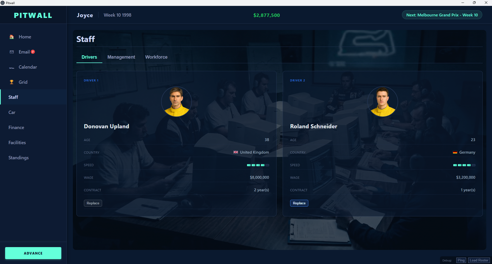

# Pitwall

An F1 Manager game built with Electron (Frontend) and Python (Backend).

## Current Features

- Playable career mode with team selection at game start.
- Persistent save/load support.
- Weekly progression loop with race/test event handling.
- Race simulation with:
  - weighted randomness using driver speed and team car speed
  - random crash outs
  - crash damage cost modeling and reporting
- Full 1998-style roster seeding pipeline (drivers, teams, circuits, calendar, staff, suppliers, sponsors).
- End-of-season rollover with:
  - points reset and season transition
  - retirements and new entrants
  - contract expiry handling for drivers
  - announced transfer application into next-season seats
  - AI vacancy recruitment for remaining open seats
  - offseason car performance recalculation
- Driver transfer system (initial version):
  - AI transfer planning + staged announcements by week
  - transfer announcements start after the first race
  - player replacement flow from Staff page via a Driver Market page
  - next-season grid reflects announced transfers
- Finance system with:
  - transaction log
  - track-level profit/loss tracker
  - prize money installments
  - title sponsorship income
  - transport costs by event geography with random variance
  - per-race driver wages and workforce payroll
  - per-race engine and tyre supplier contract costs
  - crash damage expenses
  - race finance summary emails
- Email inbox system with unread tracking and multiple categories (race/season/general).
- Dedicated UI pages for:
  - Calendar
  - Grid (staff/sponsors/suppliers views, current + next season)
  - Staff (Drivers / Management / Workforce tabs)
  - Driver profile (including starts, wins, season results)
  - Car comparison
  - Finance (Main / Tracker / Log tabs)
  - Facilities
  - Standings
- Visual polish features:
  - multiple themed page backgrounds
  - tab transition animation on key pages
  - rating widgets (speed/skill/workforce/engine style comparisons)
  - supplier/sponsor logos and country flags
  - app window opens maximized

## Project Structure

- **frontend/**: Electron + Vanilla JS frontend.
- **backend/**: Python + SQLite backend, using Pydantic for data models.

## Setup

### Prerequisites
- Node.js
- Python 3.12+
- `uv` (Python package manager)

### Installation

1.  **Frontend**:
    ```bash
    cd frontend
    npm install
    ```

2.  **Backend**:
    ```bash
    cd backend
    uv sync
    ```

## Running the Game

```bash
cd frontend
npm start
```

## Running Tests

### Backend (pytest)
Contains unit and integration tests for game logic.

```bash
cd backend
uv run pytest
```

### Frontend (vitest)
Contains component tests for UI logic.

```bash
cd frontend
npm test
```

## Staff Page Preview


