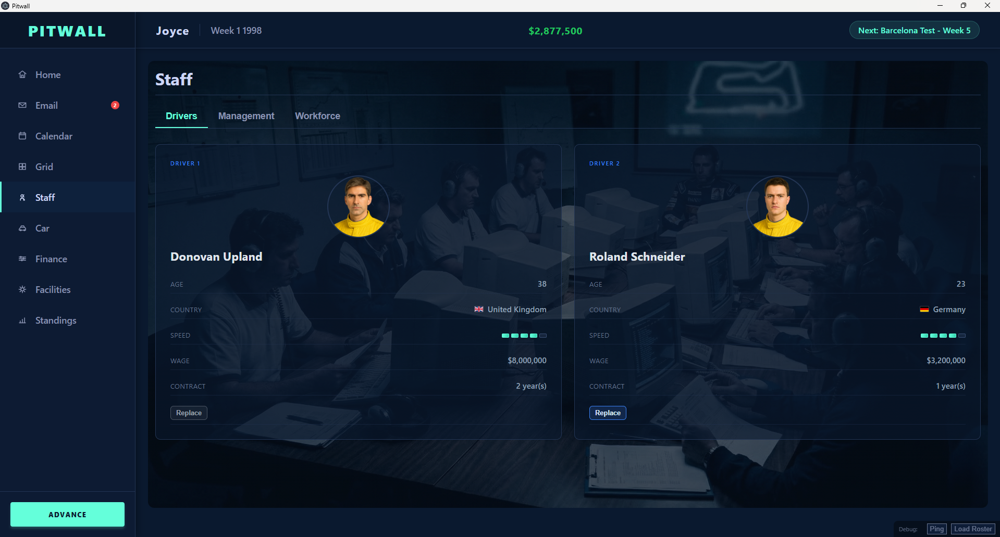

# Pitwall

An F1 Manager game built with Electron (Frontend) and Python (Backend).

## Current Features

- Playable career mode with team selection, save/load support, and a weekly progression loop.
- Full seeded world from 1998 onward, with future drivers/sponsors entering in later seasons.
- Season simulation through to the end of 2004, including retirements, new entrants, rollover, and offseason car resets.
- Race weekend flow with:
  - qualifying simulation that sets the grid
  - separate pre-race strategy screen for player pit plans
  - lap-by-lap race replay, timing, commentary, qualifying tab, and lap charts
  - first-lap logic, pit stops, crash/mechanical DNFs, and supplier effects in the race sim
- Management and transfer systems for:
  - drivers
  - technical directors
  - commercial managers
  - team principals
  - title sponsors
  - engine suppliers
  - tyre suppliers
- Improved AI driver market logic with retention, team desirability, seat role, and protected top-driver handling.
- Player staff market flows including:
  - driver replacement and pre-contract driver offers
  - sponsor replacement
  - engine and tyre supplier replacement
  - technical director and commercial manager replacement
- Finance system with:
  - season-only income/expenditure reporting
  - projected end-of-season balance
  - sponsor and supplier contract tracking
  - transaction log and event-level P/L ledger
  - prize money installments
  - driver, management, workforce, supplier, transport, testing, repair, and factory overhead costs
- Team development systems for workforce, facilities, car development, AI facilities/workforce changes, and resource-limited AI car progression.
- UI pages for:
  - Home dashboard
  - Email
  - Calendar
  - Grid
  - Staff
  - Driver profile
  - Car
  - Finance
  - Facilities
  - Standings
- Visual features including custom backgrounds, country flags, supplier/sponsor logos, portraits, rating widgets, and SVG sidebar icons.

## Project Structure

- **frontend/**: Electron + Vanilla JS frontend.
- **backend/**: Python + SQLite backend, using Pydantic for data models.

## Setup

### Prerequisites
- Node.js
- Python 3.12+
- `uv` (Python package manager)

### Installation

1.  **Frontend**:
    ```bash
    cd frontend
    npm install
    ```

2.  **Backend**:
    ```bash
    cd backend
    uv sync
    ```

## Running the Game

```bash
cd frontend
npm start
```

## Running Tests

### Backend (pytest)
Contains unit and integration tests for game logic.

```bash
cd backend
uv run pytest
```

### Frontend (vitest)
Contains component tests for UI logic.

```bash
cd frontend
npm test
```

## Staff Page Preview


