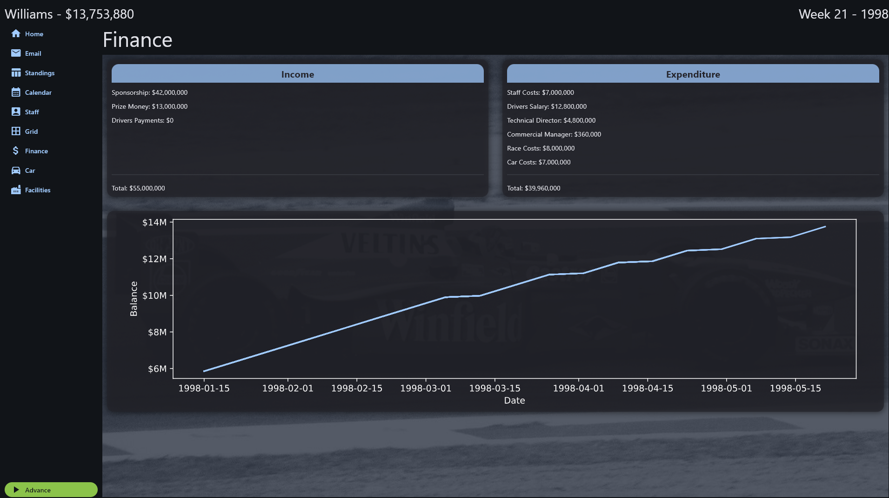
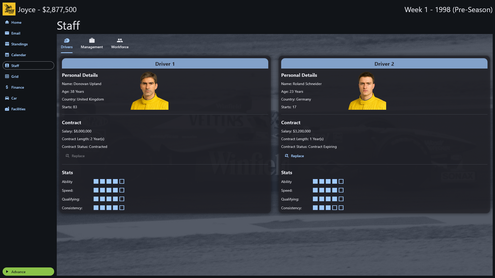
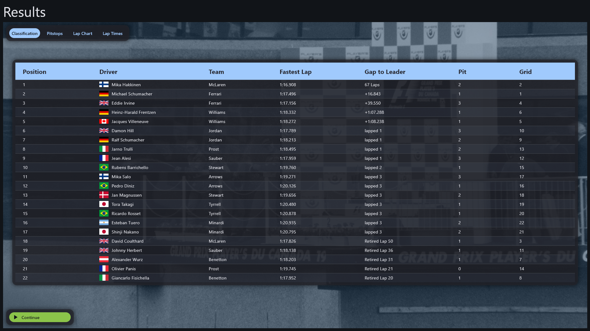

# Pitwall

Pitwall is a free and open F1 manager game being developed in python, licensed under GPLv3.

There is very limited features and gameplay at the moment. Details are provided further below.

The game starts in 1998 and will allow the player to compete through to modern day F1.

See the [ROADMAP](Roadmap.md) file for details on the planned features.

The UI is built using flet.

See the [CONTRIBUTING](Contributing.md) file if interested in helping out.

See the [acknowledgements](acknowledgements.md) file for credit of any assets used.

## Features

- Drivers/staff retire
- Qualifying and Race sessions are simulated
- New drivers/staff become available each year to hire
- Car speeds update at the start of each season
- Standard of factory facilities varies between teams
- Load/save (note game save automatically to save_game.db in src folder)
- Basic email system
- Basic car development system
- Basic facilities system


## RUNNING THE GAME

The game uses poetry to manage dependencies. The `pyproject.toml` file is located in the src folder. Ensure you are running poetry from the src folder.

Install Poetry with the following pip command:

```
pip install poetry
```

Install the dependencies with the following command:

```
poetry install
```

Run the game with the following command:

```
poetry run flet main.py
```
 
## Preview







