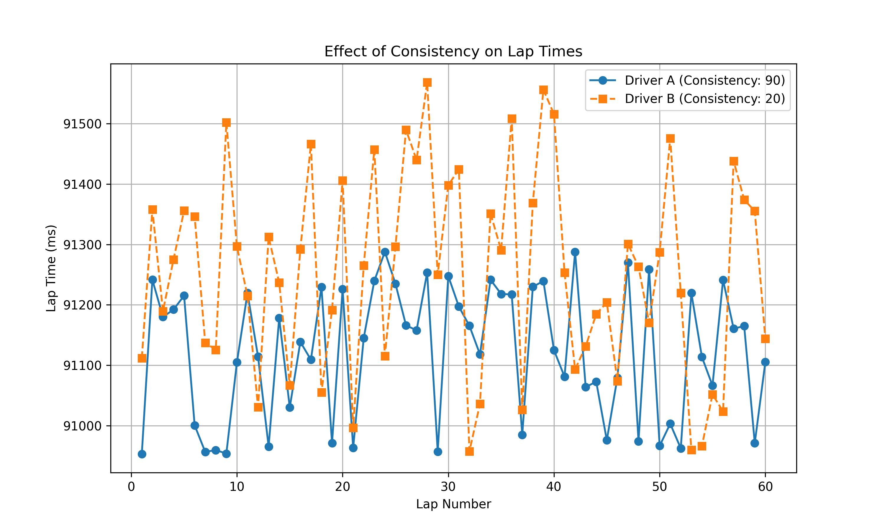

# LapTimeManager Documentation

## Overview
The `LapTimeManager` class is responsible for calculating and managing lap times for each participant in the race. It takes into account various factors such as driver skill, driver consistency, car performance, car condition (fuel/tyres), engine power, and randomness to simulate real-world lap times.

Note, a participant is a combination of a specific car and driver.

## How Lap Times Are Calculated

### 1. Base Lap Time Calculation
The foundation of any lap time is the base lap time of the track. It essentially represents the fastest possible time a participant can achieve. It is dictatated by:
- **Driver speed**: A faster driver reduces lap time.
- **Car speed**: A more powerful car also lowers the lap time.
- **Engine power**: More powerful engines reduce lap time, with the effect varying by track.

Formula:
```python
self.base_laptime = self.track_model.base_laptime
self.base_laptime += (MAX_SPEED - self.driver.speed) * DRIVER_SPEED_FACTOR
# add engine power effect
power_effect = self.calculate_engine_power_effect()
self.base_laptime += power_effect
self.base_laptime += (MAX_SPEED - self.car_model.speed) * CAR_SPEED_FACTOR
```
- A driver with a **0 speed rating** is considered **2 seconds** slower than one with **100 speed**.
- A car with a **0 speed rating** is considered **5 seconds** slower than one with **100 speed**.
- Engine power effect varies based on both the engine's power rating and the track's power sensitivity.

### 2. Engine Power Effect

The engine power effect accounts for how engine performance impacts lap times differently at various tracks. For example, tracks with long straights (like Monza) are more sensitive to engine power than tracks with many corners (like Monaco).

Formula:
```python
# Get engine power (0-100 scale) from engine supplier
engine_power = self.participant.team_model.engine_supplier_model.power

# Track power sensitivity (1-10) affects how much engine power matters
track_power_sensitivity = self.participant.track_model.power

# Calculate power effect
# POWER_SENSITIVITY (2000ms = 2s) is the maximum possible effect at power sensitivity 10
# At sensitivity 1, effect is reduced to 10% of maximum
power_effect = (POWER_SENSITIVITY * track_power_sensitivity / 10)

# A power rating of 50 is neutral (no gain/loss)
# Below 50 loses time, above 50 gains time
return int(power_effect * (50 - engine_power) / 100)
```

Key points:
- Engine power is rated on a scale of 0-100, with higher values being better.
- Track power sensitivity ranges from 1-10, with 10 being highly sensitive to power differences.
- A power rating of 50 is considered neutral (no time gain or loss).
- At a track with maximum power sensitivity (10), the difference between the weakest (0) and strongest (100) engine could be up to 2 seconds per lap.
- At a track with low power sensitivity (1), the maximum difference is reduced to just 0.2 seconds per lap.

#### Examples of Engine Power Effect

Let's calculate some examples using the formula above (assuming `POWER_SENSITIVITY = 2000`):

**Example 1: High-powered engine (80) at power-sensitive track (8)**
```
power_effect = (2000 * 8 / 10) * (50 - 80) / 100
power_effect = 1600 * (-30) / 100
power_effect = -480ms
```
This engine would gain 480ms (0.48s) per lap at this track.

**Example 2: Low-powered engine (30) at power-sensitive track (8)**
```
power_effect = (2000 * 8 / 10) * (50 - 30) / 100
power_effect = 1600 * 20 / 100
power_effect = 320ms
```
This engine would lose 320ms (0.32s) per lap at this track.

**Example 3: High-powered engine (80) at technical track (3)**
```
power_effect = (2000 * 3 / 10) * (50 - 80) / 100
power_effect = 600 * (-30) / 100
power_effect = -180ms
```
The same high-powered engine only gains 180ms (0.18s) at this less power-sensitive track.

**Example 4: Average engine (50) at any track**
```
power_effect = (any value) * (50 - 50) / 100
power_effect = (any value) * 0
power_effect = 0ms
```
An engine with exactly 50 power neither gains nor loses time.

**Example 5: Extreme case - Best engine (100) vs Worst engine (0) at most power-sensitive track (10)**
```
Best engine:   (2000 * 10 / 10) * (50 - 100) / 100 = 2000 * (-50) / 100 = -1000ms
Worst engine:  (2000 * 10 / 10) * (50 - 0) / 100 = 2000 * 50 / 100 = 1000ms
Difference: 2000ms (2 seconds)
```
This illustrates the maximum possible difference between the best and worst engines.

### 3. Lap Time Variation

Lap times are not constant due to natural driving inconsistencies. The variation is calculated as:

```python
additonal_laptime_variaton = int((1 - (self.driver.consistency / 100)) * LAP_TIME_VARIATION)
self.laptime_variation = LAP_TIME_VARIATION_BASE + additonal_laptime_variaton
```

- `LAP_TIME_VARIATION_BASE` is a fixed 300ms variation that applies to all drivers.
- `LAP_TIME_VARIATION` is an additional 400ms that applies depending on driver consistency.
- A driver with **100 consistency** has **0ms additional variation**, while a driver with **0 consistency** has the full **400ms additional variation**.

Below shows a laptime comparison of a driver with a consistency rating of 90 and 20.



### 4. Calculating a Lap Time
Each lap time is determined using:

```python
random_time_loss = self.randomiser.random_laptime_loss()
self.laptime = self.base_laptime + random_time_loss + self.car_state.fuel_effect + self.car_state.tyre_wear + dirty_air_effect
```
Where:
- `random_time_loss` adds a realistic variation.
- `fuel_effect` accounts for added weight from fuel.
- `tyre_wear` increases the lap time as tires degrade.
- `dirty_air_effect` simulates aerodynamic disadvantage when following another car.

### 5. Pit Stop Time Adjustment
If a participant is **pitting**, the lap time is adjusted by adding:
```python
self.laptime += self.track_model.pit_stop_loss
self.laptime += self.participant.pitstop_times[-1]
```
This ensures pit stops have a realistic time penalty.

### 6. First Lap Time Calculation
The first lap is handled differently because cars start from a grid position and experience more traffic.
```python
random_time_loss = self.randomiser.random_lap1_time_loss()
self.laptime = self.track_model.base_laptime + LAP1_TIME_LOSS + (idx * LAP1_TIME_LOSS_PER_POSITION) + random_time_loss
```

Here, `idx` represents the car's position after turn 1, which increases lap time losses due to congestion. The intent of this calculation is to spread the field out after turn 1. No position changes after turn 1 can occur.

### 7. Adjusting Time When Overtaken
When a car is overtaken, its lap time is revised:
```python
self.laptime = revised_laptime
self.laptimes[-1] = revised_laptime
```

This ensures that the total time reflects the real-time loss from being passed.

## Summary of Factors Affecting Lap Times

| Factor                | Effect on Lap Time |
|-----------------------|-------------------|
| Track Base Lap Time  | Baseline for all calculations |
| Driver Speed        | Faster driver decreases lap time |
| Car Speed          | Faster car decreases lap time |
| Engine Power       | Higher power decreases lap time, effect varies by track |
| Track Power Sensitivity | Determines impact of engine power (1-10 scale) |
| Random Variation   | Introduces unpredictability |
| Fuel Load         | Higher fuel increases lap time |
| Tyre Wear         | More wear increases lap time |
| Dirty Air Effect  | Following cars experience increased lap times |
| Pit Stop          | Adds pit stop loss time |
| First Lap Position | Further back increases lap time |
| Being Overtaken   | Adjusts lap time to reflect time lost |

This class provides a realistic simulation of lap times based on multiple contributing factors.
